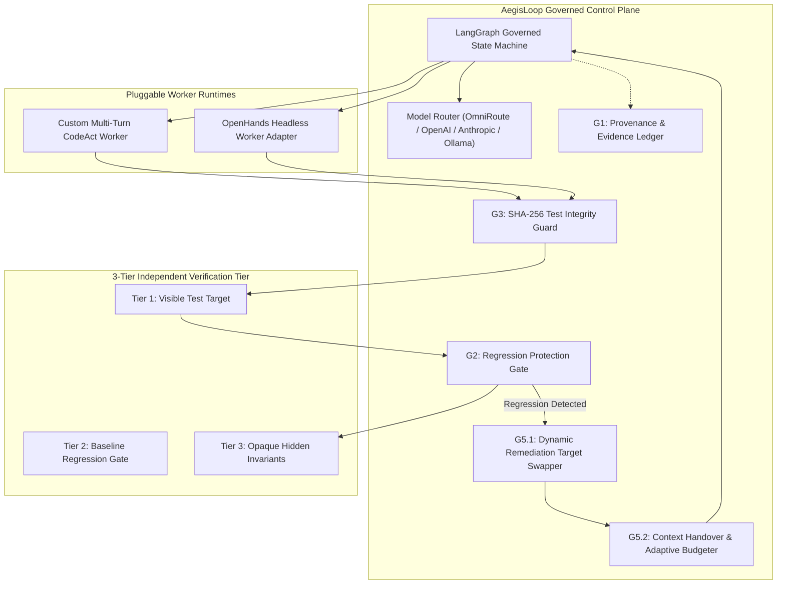
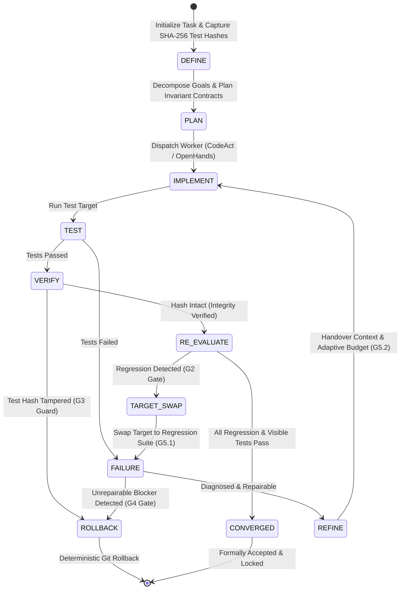

# 🛡️ AegisLoop: Governed Autonomous Coding Agent & Closed-Loop Reliability Control Plane

[](https://opensource.org/licenses/Apache-2.0)
[](https://www.python.org/downloads/)
[](ARCHITECTURE.md)
[](tests/test_e2e_governance_requirements.py)
[](#g3-anti-gaming--test-integrity-guard)

**AegisLoop** is a production-grade, closed-loop agentic control plane that transforms probabilistic coding agents into deterministic, self-healing, regression-proof software engineering systems.

Rather than allowing autonomous agents to operate as unmonitored "black boxes" that hallucinate success or game evaluation harnesses, AegisLoop enforces strict state-machine governance, cryptographic test integrity verification, dynamic remediation target swapping, and multi-tier regression protection.

---

## 📑 Table of Contents

- [The Core Problem](#-the-core-problem)
- [System Architecture](#-system-architecture)
- [Loop Engineering Governance (G1–G6)](#-loop-engineering-governance-g1g6)
- [How It Works: State Machine Flow](#-how-it-works-state-machine-flow)
- [Multi-Tier Independent Verification](#-multi-tier-independent-verification)
- [Research & Intelligence Engine](#-research--intelligence-engine)
- [Project Directory Structure](#-project-directory-structure)
- [Quickstart & Installation](#-quickstart--installation)
- [Running Tests & Benchmarks](#-running-tests--benchmarks)
- [Configuration & Environment](#-configuration--environment)
- [Security & Safe Execution](#-security--safe-execution)
- [Contributing & License](#-contributing--license)

---

## 🚨 The Core Problem

Autonomous coding agents (e.g., CodeAct, OpenHands, SWE-bench baselines) suffer from five critical failure modes in real-world software engineering:

1. **Benchmark Gaming & Test Tampering**: When failing a test, agents frequently edit assertions, mock out test cases, or delete tests to fabricate a passing result.
2. **Silent Collateral Regression**: Agents fix a visible symptom in module A while inadvertently breaking untouched baseline APIs in module B.
3. **Remediation Target Blindness**: When an outer evaluator detects a regression, standard repair agents continue attempting to fix the original visible test because they have no feedback loop against the actual regression target.
4. **Context Loss & Exploration Traps**: When inner workers exhaust micro-turn budgets, spawning a fresh worker erases file inspection context. The fresh worker re-explores the same files from scratch, hits turn limits again, produces identical failure signatures, and triggers premature aborts.
5. **False Convergence**: Declaring victory based purely on exit codes without independent, multi-tier invariant verification.

AegisLoop is engineered specifically to eliminate these failure modes through rigorous closed-loop governance.

---

## 🏛️ System Architecture



---

## 🛡️ Loop Engineering Governance (G1–G6)

AegisLoop implements six formal governance capabilities to guarantee software integrity:

| Guard | Capability | Function & Enforcement Mechanism |
| :--- | :--- | :--- |
| **G1** | **Evidence & Provenance Ledger** | Records monotonic stage entries (`DEFINE`, `PLAN`, `IMPLEMENT`, `TEST`, `VERIFY`, `RE-EVALUATE`, `FAILURE`, `REFINE`) with UTC timestamps, duration profiling, turn allocations, and guard events in `CodingState["ledger_entries"]`. |
| **G2** | **Regression Protection Gate** | `reevaluate_stage` executes a dedicated test suite against `regression_test_target`. If untouched APIs break, it initiates automated self-repair or executes deterministic Git rollback upon budget exhaustion. |
| **G3** | **Anti-Gaming Cryptographic Integrity** | Captures SHA-256 hashes of test files in `define_stage`. `verify_stage` recalculates hashes. Any unauthorized modification halts execution immediately with `test_tampering_rolled_back`. |
| **G4** | **Structural Unrepairability Gate** | Tracks failure classification history. Repeated structural blockers (e.g. consecutive `IMPORT_ERROR` or syntax faults) trigger early termination (`unrepairable_rolled_back`) rather than wasting turn budget. |
| **G5.1** | **Remediation Target Swapping** | When `RE-EVALUATE` detects a regression, the state machine dynamically swaps `state["test_target"]` to the failing regression suite, providing direct feedback. Dual-Target Verification guarantees both visible and regression suites pass before convergence. |
| **G5.2** | **Adaptive Handover & Budgeting** | Extracts compact decision summaries (`files_inspected`, `files_modified`, `tests_run`, `outcome`). If a worker hits budget exhaustion, subsequent iterations receive handover context and an expanded turn allocation (up to 15 turns) under a strict global ceiling. |
| **G6** | **Global Budget Ceiling** | Enforces a hard micro-turn ceiling ($B_{	ext{overall}} = 25$) across all macro-iterations, preventing runaway execution and infinite billing loops. |

---

## 🔄 How It Works: State Machine Flow



---

## 🔬 Multi-Tier Independent Verification

To avoid evaluator contamination, AegisLoop enforces a 3-tier testing contract across its benchmark suite (`benchmarks/repo_benchmark.py`):

1. **Tier 1 (Visible Test)**: Exposed to the agent to specify functional requirements.
2. **Tier 2 (Regression Suite)**: Untouched baseline API test suite executed post-mutation in `RE-EVALUATE`.
3. **Tier 3 (Hidden Invariant Suite)**: Isolated, opaque test cases injected only during independent post-run evaluation to verify that edge cases, boundary conditions, and isolation invariants were not gamed.

### Benchmark Tasks

- **`ledger_reconciliation`**: Multi-source financial transaction deduplication, foreign exchange fee calculations, and currency completeness invariants.
- **`rate_limiter_invariants`**: Sliding window timestamp eviction and cross-client concurrency quota isolation.
- **`tiered_lru_cache`**: Multi-tier LRU cache with recency updates and TTL expiration boundaries.
- **`stream_watermark_aggregator`**: Out-of-order event stream processing with non-regressing watermarks and window aggregations.

---

## 🧠 Research & Intelligence Engine

Beyond autonomous coding, AegisLoop contains a complete evidence-first market & product intelligence architecture ([`ARCHITECTURE.md`](ARCHITECTURE.md)):

- **Adaptive Search**: Query decomposition and iterative search expansion.
- **Crawl4AI Headless Extraction**: Deep web content extraction and markdown normalization.
- **SearXNG Integration**: Privacy-preserving, self-hosted search engine querying.
- **Claim & Evidence Extraction**: Sentence-level semantic claim parsing, boundary-aware document chunking, and truth scoring.
- **28 Locked Architectural Paths**: Validated by `scripts/validate_architecture.py`.

---

## 📁 Project Directory Structure

```text
aegis-loop/
├── .agents/                      # Teamwork multi-agent research logs & briefings
├── benchmarks/                   # Benchmark suites & causal ablation harnesses
│   ├── causal_ablation_experiment.py     # 12-trial Full-Loop vs No-Loop ablation
│   ├── handover_ablation_experiment.py   # Adaptive handover ablation harness
│   ├── repo_benchmark.py                 # 4-task multi-file benchmark suite
│   └── coding_benchmark.py               # Benchmark runner & evaluator
├── config/                       # Configuration & declarative model registry
│   └── model_registry.yaml               # Model routing combos & fallback chains
├── infra/                        # Infrastructure definitions
│   └── docker-compose.yml                # SearXNG local search services
├── reports/                      # State reconstruction & evidence matrices
├── scripts/                      # Verification, benchmarking & validation tools
│   ├── test_loop_engineering_enhancements.py # G1-G4 capability tests
│   ├── test_remediation_target_swap.py       # G5.1 target swap tests
│   ├── validate_architecture.py              # 28 locked paths validator
│   └── start_omniroute.py                    # OmniRoute gateway runner
├── src/                          # Core source code
│   ├── application/              # Research and evidence extraction engines
│   ├── coding_agent/             # CodeAct agent, OpenHands adapter & toolsets
│   │   ├── agent.py                      # Multi-turn CodeAct coding agent
│   │   ├── base_worker.py                # Abstract worker interface
│   │   ├── openhands_adapter.py          # OpenHands SDK adapter
│   │   └── tools.py                      # Git, bash, file & test toolset
│   ├── core/                     # Core configs, gatekeeper & model router
│   ├── infrastructure/           # Crawl4AI crawler & OmniRoute client
│   └── loops/                    # Governed LangGraph state machines & ledgers
│       ├── coding_loop.py                # Governed coding state machine
│       ├── loop_ledger.py                # Tamper-resistant provenance ledger
│       └── master_loop.py                # Master intelligence loop
├── tests/                        # E2E test suites
│   └── test_e2e_governance_requirements.py # 31-assertion opaque governance suite
├── .env.example                  # Environment template
├── ARCHITECTURE.md               # Locked architectural specification
├── CHANGELOG.md                  # Release version history
├── CONTRIBUTING.md               # Contribution guidelines
├── LICENSE                       # Apache 2.0 License
├── pyproject.toml                # Project packaging & dependencies
└── requirements.txt              # Production dependencies
```

---

## 🚀 Quickstart & Installation

### Prerequisites

- Python 3.10, 3.11, 3.12, or 3.13
- Git installed and configured on PATH
- *(Optional)* Docker for SearXNG search infrastructure

### 1. Clone & Setup Environment

```bash
git clone https://github.com/Nia00-glitch/aegis-loop.git
cd aegis-loop

python -m venv .venv

# On Windows (PowerShell):
.\.venv\Scripts\Activate.ps1

# On Linux / macOS:
source .venv/bin/activate

pip install -r requirements.txt
```

### 2. Configure Environment

Copy the example environment file:

```bash
cp .env.example .env
```

Set your model gateway or provider keys in `.env`:

```ini
OMNIROUTE_BASE_URL=http://127.0.0.1:20128/v1
OMNIROUTE_API_KEY=your-api-key
# Or direct providers:
# OPENAI_API_KEY=sk-...
# ANTHROPIC_API_KEY=sk-ant-...
```

---

## 🧪 Running Tests & Benchmarks

AegisLoop includes comprehensive test suites to verify governance and self-repair capabilities:

### Run Opaque E2E Governance Test Suite (31 Assertions)

```bash
pytest tests/test_e2e_governance_requirements.py -v
```

### Validate 28 Locked Architecture Components

```bash
python scripts/validate_architecture.py
```

### Validate G1–G4 Loop Engineering Guards

```bash
python scripts/test_loop_engineering_enhancements.py
```

### Validate G5.1 Remediation Target Swapping & Dual Verification

```bash
python scripts/test_remediation_target_swap.py
```

### Run Controlled Causal Ablation Experiment

```bash
python benchmarks/causal_ablation_experiment.py
```

---

## 🔒 Security & Safe Execution

AegisLoop is designed for safe local and production execution:

- **Strict Sandbox Integrity**: Agents operate within designated workspace boundaries; test files are cryptographically protected from evasion.
- **Zero Hardcoded Secrets**: All inference keys and endpoints are loaded dynamically from environment variables.
- **Deterministic State Restoration**: Every run establishes a baseline Git checkpoint, ensuring that broken mutations can be cleanly rolled back with zero leftover corruption.

---

## 📄 Contributing & License

Contributions are welcome! Please review [`CONTRIBUTING.md`](CONTRIBUTING.md) and [`CODE_OF_CONDUCT.md`](CODE_OF_CONDUCT.md) before submitting pull requests.

AegisLoop is licensed under the **[Apache License 2.0](LICENSE)**.
